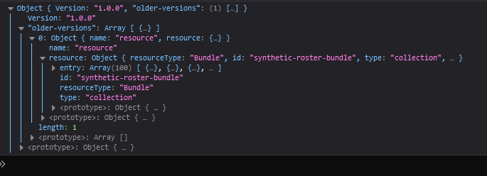

# Better Node Logs

This package is solves the problem of not being able to view objects in the terminal, even though there are multiple options, I found it easier to create a package for ths problem


## Installation

To install the package

```bash
  npm install -D node-browser-logger
```
create a watch script to start the server that'll send the logs from node to browser
```json
   "scripts":{
     "watch":"watch-logs"
   }
```
Run this command for once in a seperate terminal session
```bash
    npm run watch
```


### now for any file you wanna log just add
```javascript
 require("node-browser-logger").logger(); 
//  your code goes here...
console.log("Something!")
 ```


## Screenshots

### Before

### After

## Screenshots




